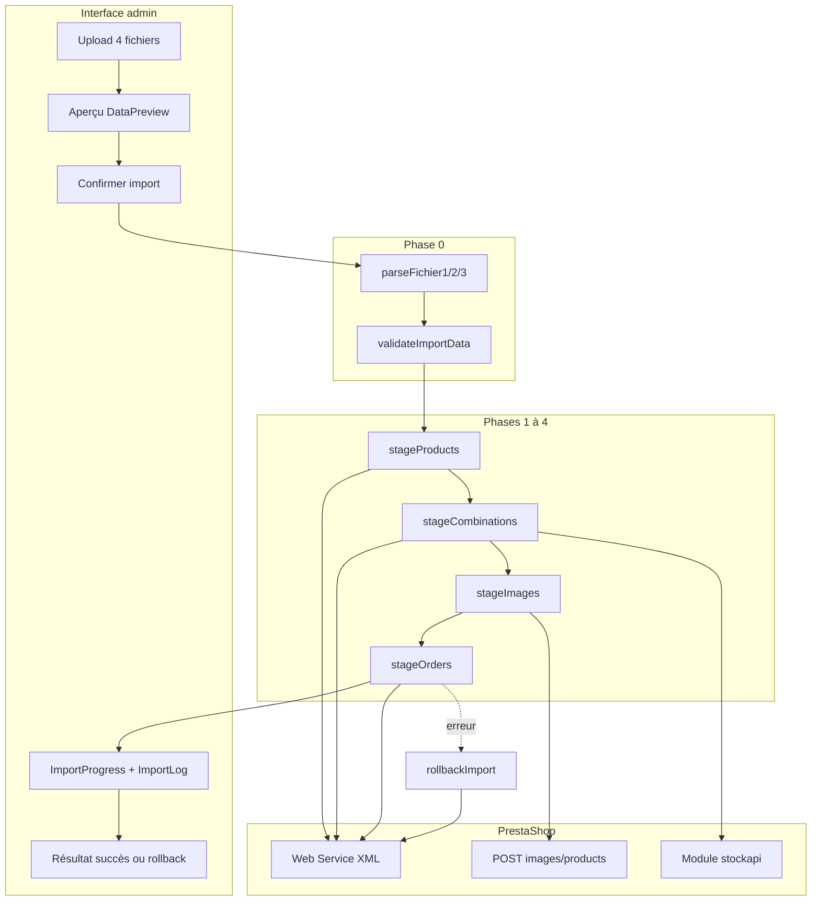

# Import de fichiers — workflow complet

Ce document décrit **étape par étape** la logique d’import CSV/ZIP de l’application admin (`newApp`), les services appelés, les endpoints PrestaShop utilisés, et les prérequis pour faire fonctionner l’import.

---

## Vue d’ensemble

L’import est un pipeline **tout-ou-rien** (simulation transactionnelle côté application) :

1. L’utilisateur admin charge **4 fichiers** (3 CSV + 1 ZIP d’images).
2. Parsing et **aperçu** local (sans écriture PS).
3. À la confirmation : **validation métier** puis **4 étapes d’écriture** vers PrestaShop via l’API Web Service.
4. En cas d’erreur après le début des écritures : **rollback** par suppressions `DELETE` dans l’ordre inverse des dépendances.



---

## Points d’entrée

| Élément | Fichier | Rôle |
|---------|---------|------|
| Route | `newApp/src/router/routes.js` | `path: '/import'`, `requiresAuth: true` |
| Page | `newApp/src/views/import/ImportView.vue` | Conteneur de la page |
| Wizard | `newApp/src/components/import/ImportWizard.vue` | Orchestration UI en 4 étapes |
| Store Pinia | `newApp/src/stores/import.js` | Logs, progression, statut, résultats |
| Orchestrateur API | `newApp/src/api/import.js` | `runTransactionalImport`, stages, rollback |

### Composants UI

| Composant | Fichier | Rôle |
|-----------|---------|------|
| `FileUploader` | `components/import/FileUploader.vue` | Sélection fichier1/2/3 + ZIP |
| `DataPreview` | `components/import/DataPreview.vue` | Tableaux d’aperçu |
| `ImportProgress` | `components/import/ImportProgress.vue` | Barre de progression |
| `ImportLog` | `components/import/ImportLog.vue` | Journal temps réel |

### Étapes du wizard

| Étape UI | `currentStep` | Action |
|----------|---------------|--------|
| 1. Upload | `upload` | Sélection des 4 fichiers obligatoires |
| 2. Aperçu | `preview` | `parseFichier1/2/3` → affichage (pas de validation métier complète) |
| 3. Import | `importing` | `runTransactionalImport(...)` |
| 4. Résultat | `result` | Stats ou message rollback |

**Fonction centrale côté UI :** `runImport()` dans `ImportWizard.vue` appelle :

```javascript
runTransactionalImport(
  { csvProduits, csvDeclinaisons, csvCommandes, zipImages: files.images },
  onProgress,
  logImport
)
```

---

## Fichiers attendus

### Fichier 1 — Produits (`fichier1.csv`)

**Parser :** `parseFichier1` — `newApp/src/services/import/csvParser.js`

| Colonne | Obligatoire | Description |
|---------|-------------|-------------|
| `date_availability_produit` | Non | Date dispo produit — format **DD/MM/YYYY** |
| `nom` | Oui | Nom du produit |
| `reference` | Oui | Référence unique |
| `prix_ttc` | Oui | Prix TTC (> 0) |
| `Taxe` | Non | Taux ou libellé taxe |
| `categorie` | Oui | Nom de catégorie |
| `prix_achat` | Non | Prix d’achat (≥ 0) |

### Fichier 2 — Déclinaisons (`fichier2.csv`)

**Parser :** `parseFichier2`

| Colonne | Obligatoire | Description |
|---------|-------------|-------------|
| `reference` | Oui | Référence produit (doit exister en fichier1) |
| `specificité` | Non | Type d’attribut : `Taille` ou `Couleur` |
| `karazany` | Non | Valeur de l’attribut (ex. `ngoza`, `kely`) |
| `stock_initial` | Oui | Quantité initiale (≥ 0) |
| `prix_vente_ttc` | Non | Prix TTC de la déclinaison si différent |

**Règle métier :** un seul type de spécificité par produit (taille **ou** couleur, pas les deux).

Lignes sans `specificité` / `karazany` : stock appliqué sur le **produit simple** (sans déclinaison).

### Fichier 3 — Commandes (`fichier3.csv`)

**Parser :** `parseFichier3`

| Colonne | Obligatoire | Description |
|---------|-------------|-------------|
| `date` | Oui | Date commande — **DD/MM/YYYY** (heure optionnelle) |
| `nom` | Oui | Nom client |
| `email` | Oui | Email (clé de dédoublonnage client) |
| `pwd` | Non | Mot de passe transmis tel quel à `createCustomer` |
| `adresse` | Non | Adresse livraison |
| `achat` | Oui | Lignes panier — voir format ci-dessous |
| `etat` | Non | État commande ou panier — voir § Panier vs commande |

**Format du champ `achat` :**

```text
[("T_01";3;"ngoza"),("C_03";1;"")]
```

- `reference` : référence produit
- `quantity` : quantité entière > 0
- `variant` : valeur `karazany` (déclinaison) ou vide

**Parser dédié :** `parseAchatField(achatString)`

### Fichier 4 — Images (`images.zip`)

**Services :**

- `extractZip` — `newApp/src/services/import/zipExtractor.js`
- `getProductReferenceFromFilename` — extrait la référence depuis le nom de fichier image
- `uploadProductImages` — `newApp/src/services/import/imageUploader.js`

Convention : le nom de fichier doit permettre de retrouver la **référence produit** du fichier1.

---

## Règles de parsing CSV

Fichier : `newApp/src/services/import/csvParser.js`

- Séparateur : **virgule** (`,`), champs entre guillemets supportés (`parseCSVLine`).
- BOM UTF-8 retiré en tête de fichier.
- En-têtes : comparaison **insensible à la casse** ; colonnes **manquantes ou en trop** → erreur immédiate (`validateHeaders`).
- Les en-têtes doivent correspondre au format canonique (accents inclus, ex. `specificité`, `Taxe`).

**Hors flux wizard :** `csvImportService.js` et `mapper.js` sont des utilitaires génériques **non branchés** sur l’Import Wizard.

---

## Phase 0 — Parsing et validation

**Point d’entrée :** `runTransactionalImport` dans `newApp/src/api/import.js`

### Séquence

1. `resetImportContext()` — vide les caches mémoire
2. `clearTaxCache()` — reset cache taxes
3. `createTxCtx()` — initialise le contexte rollback
4. `parseFichier1` / `parseFichier2` / `parseFichier3`
5. `validateImportData({ products, variants, orders }, onLog)`

### `validateImportData` — contrôles

| Fichier | Contrôles principaux |
|---------|----------------------|
| Fichier1 | `nom`, `reference` uniques, `prix_ttc` > 0, `categorie`, dates DD/MM/YYYY |
| Fichier2 | `reference` ∈ fichier1, `stock_initial` ≥ 0, une seule spécificité par produit |
| Fichier3 | email valide, `date` DD/MM/YYYY, références achat connues, quantités > 0 |

En échec : logs `❌` par erreur puis `throw new Error('Validation échouée: N erreur(s)...')`.

**Important :** la colonne `etat` n’est **pas** validée en phase 0 ; elle est interprétée en **étape 4** uniquement.

---

## Contextes mémoire

### `importContext` (caches référence → ID)

| Map | Clé | Valeur |
|-----|-----|--------|
| `products` | `reference` | `{ id, name, priceTTC, priceHT, taxRate, ... }` |
| `categories` | nom normalisé | `categoryId` |
| `attributeGroups` | nom groupe | `groupId` |
| `attributeValues` | `groupId::valeur` | `valueId` |
| `combinations` | `reference::karazany` | `{ id, priceTTC, priceHT }` |
| `customers` | `email` | `customerId` |
| `addresses` | `customerId::adresse` | `addressId` |

### `txCtx` (entités créées — pour rollback)

```javascript
{
  taxGroups: [],      // [{ groupId, taxId }]
  categories: [],
  products: [],
  attributeGroups: [],
  attributeValues: [],
  combinations: [],
  images: [],         // [{ productId, imageId }]
  addresses: [],
  customers: [],
  carts: [],
  orders: [],
}
```

---

## Phase 1 — Produits (`stageProducts`)

**Parallélisme :** 5 produits en simultané (`PRODUCT_CONCURRENCY = 5`).

### Sous-phases

| Phase | Action | API / service |
|-------|--------|----------------|
| 1.A | Charger catégories et groupes de taxes existants | `getCategories`, `getTaxRuleGroups` |
| 1.B | Créer les nouvelles catégories | `createCategory` → `POST /categories` |
| 1.C | Pré-créer groupes de taxe uniques | `getOrCreateTaxRuleGroup` → `POST /taxes`, `/tax_rule_groups`, `/tax_rules` |
| 1.D | Créer chaque produit | `createProduct` → `POST /products` |

**Calculs :** prix HT via `calculatePriceHT(prix_ttc, taxRate)` (`taxMapper.js`).

**Constantes PS souvent utilisées :** `id_category_default: 2` (Home), shop/lang/devise selon API produits.

---

## Phase 2 — Déclinaisons (`stageCombinations`)

**Parallélisme :** 5 (`COMBINATION_CONCURRENCY = 5`).

### Sous-phases

| Phase | Action | API / service |
|-------|--------|----------------|
| 2.A | Charger groupes d’attributs PS | `getAttributeGroups` → `GET /product_options` |
| 2.B | Séparer lignes « stock produit simple » vs déclinaisons | logique interne |
| 2.C | Créer groupes/valeurs d’attributs si besoin | `getOrCreateAttributeGroup`, `getOrCreateAttributeValue` |
| 2.D | Stock produit sans déclinaison | `applyStockMovement` |
| 2.E | Créer combinaison + stock | `createCombination` → `POST /combinations` + stock |

### Stock — `applyStockMovement`

1. Calcul du delta vers la quantité cible.
2. **Priorité :** module `stockapi` — `updateStockViaModule`  
   `POST /ps/index.php?fc=module&module=stockapi&controller=stock`
3. **Fallback :** `updateProductStock` / `updateCombinationStock`  
   `GET` + `PUT /stock_availables/{id}`

Fichiers : `newApp/src/api/stockModule.js`, `newApp/src/api/stock.js`.

---

## Phase 3 — Images (`stageImages`)

| Étape | Service | Endpoint |
|-------|---------|----------|
| Extraire ZIP | `extractZip` | Local (JSZip) |
| Grouper par référence | `getProductReferenceFromFilename` | — |
| Upload | `uploadProductImage` | `POST {API_BASE}/images/products/{productId}` (multipart `fetch`) |

**Comportement :** échec sur une image → `throw` → rollback global.

La première image d’un produit peut être marquée **cover**.

---

## Phase 4 — Commandes (`stageOrders`)

**Parallélisme commandes :** 4 (`ORDER_CONCURRENCY = 4`).

### Sous-phases

| Phase | Action | API / service |
|-------|--------|----------------|
| 4.A | Corriger logo TCPDF (PDF) | `patchLogoUrlToHttp` → `GET/PUT /configurations` |
| 4.B | Pré-résoudre clients existants par email | `findCustomersByEmails` → `GET /customers?filter[email]=...` |
| 4.C | Créer clients nouveaux (dédoublonnés) | `createCustomer` → `POST /customers` |
| 4.D | Créer adresses (dédoublonnées) | `createAddress` → `POST /addresses` |
| 4.E | Pour chaque ligne CSV : panier **ou** commande | voir ci-dessous |

**Adresses import :** ville `Antananarivo`, code postal `101`, pays par défaut (souvent `id_country: 8` dans `addresses.js`).

### Panier vs commande — `isCartState`

```javascript
const isCartState =
  !rawState ||
  normalizedState.includes('panier') ||
  normalizedState.includes('cart') ||
  normalizedState.includes('non commande') ||
  normalizedState.includes('non command')
```

| Valeur `etat` (exemples) | Résultat | Endpoints |
|--------------------------|----------|-----------|
| *(vide)* | Panier ouvert uniquement | `POST /carts` via `createCartFromOrder` |
| `dans le panier`, `non commande` | Panier ouvert uniquement | idem |
| `paiement accepté`, `en attente paiement à la livraison`, etc. | Commande PS | `createOrder` dans `orders.js` |

#### Panier seul — `createCartFromOrder` (dans `import.js`)

- `POST /carts` avec `id_customer`, adresses, `cart_rows`, dates `date_add` / `date_upd` depuis CSV.
- Constantes : `id_currency=1`, `id_lang=1`, `id_carrier=1`, `id_shop=1`.
- **Pas** de `POST /orders`.

#### Commande — `createOrder` (`newApp/src/api/orders.js`)

1. Créer panier si absent : `POST /carts`
2. Créer commande : `POST /orders` avec totaux HT/TTC, `current_state` résolu depuis `etat`
3. Si besoin : correction état via `POST /order_histories`
4. Mise à jour dates : `PUT /orders/{id}`

**Résolution d’état :** `resolveOrderStateId(client, etat)` — heuristiques sur libellés (`paiement accepté`, `livraison`, etc.) via `GET /order_states`.

---

## Rollback — `rollbackImport`

Déclenché si une étape 1–4 échoue après des écritures API.

**Ordre de suppression (inverse des dépendances) :**

1. `orders`
2. `carts`
3. `combinations`
4. `images` (`DELETE /images/products/{productId}/{imageId}`)
5. `products`
6. `categories` (nouvelles uniquement)
7. `addresses`
8. `customers` (nouveaux uniquement)
9. `product_option_values`
10. `product_options`
11. `tax_rule_groups` + `taxes`

**Client rollback :** `deleteResourceItem`, `deleteProductImage` — `newApp/src/services/reset/apiClient.js`.

**Limites connues :**

- Pas de rollback des mouvements de stock module `stockapi`.
- Clients/catégories déjà existants avant l’import ne sont pas supprimés s’ils n’ont pas été créés dans `txCtx`.

---

## Récapitulatif des endpoints PrestaShop

Base URL : `VITE_PRESTASHOP_API_BASE_URL` (ex. `/ps/api`).  
Authentification : **Basic** avec `VITE_PRESTASHOP_API_KEY` (client Axios `getXmlClient()` dans `xmlClient.js`).

| Ressource | Méthodes | Utilisation import |
|----------|----------|-------------------|
| `/categories` | GET, POST, DELETE | Catégories produits |
| `/taxes`, `/tax_rule_groups`, `/tax_rules` | GET, POST, DELETE | Taxes |
| `/products` | POST, DELETE | Création produits |
| `/product_options` | GET, POST, DELETE | Groupes attributs |
| `/product_option_values` | POST, DELETE | Valeurs attributs |
| `/combinations` | POST, DELETE | Déclinaisons |
| `/stock_availables` | GET, PUT | Fallback stock |
| `/images/products/{id}` | POST, DELETE | Upload images |
| `/customers` | GET, POST, DELETE | Clients commandes |
| `/addresses` | POST, DELETE | Adresses |
| `/carts` | POST, DELETE | Paniers + paniers liés aux commandes |
| `/orders` | POST, PUT, DELETE | Commandes |
| `/order_histories` | POST | Forcer état commande |
| `/order_states` | GET | Résolution libellé → ID |
| `/configurations` | GET, PUT | Logo TCPDF |
| Module `stockapi` | GET, POST | Mouvements stock |

---

## Configuration et prérequis

### Variables d’environnement (`.env.local`)

| Variable | Rôle |
|----------|------|
| `VITE_PRESTASHOP_API_BASE_URL` | Base Web Service + upload images |
| `VITE_PRESTASHOP_API_KEY` | Clé API (Basic auth) |
| `VITE_PRESTASHOP_PROXY_TARGET` | Cible proxy Vite en dev |
| `VITE_PRESTASHOP_ADMIN_DIR` | Admin PS (indirect) |

Fichiers : `newApp/vite.config.js`, `newApp/src/config/runtimeEnv.js`.

### Authentification admin

- Route `/import` protégée par `requiresAuth: true`.
- Au login admin : initialisation du client XML (`initXmlClient` dans `stores/auth/auth.js`).
- Sans session : `getXmlClient()` lève une erreur.

### Modules PrestaShop requis

- **Web Service** activé avec droits CRUD sur les ressources listées ci-dessus.
- Module **`stockapi`** installé pour les mouvements de stock à l’import (fallback API natif si échec).

### Fichiers d’exemple

`newApp/csv/import-data-mai-26 - fichier{1,2,3}.csv`

---

## Progression et logs

### Callback `onProgress(step, item, processed, total)`

| `step` | Étape |
|--------|-------|
| `import_products` | Phase 1 |
| `import_combinations` | Phase 2 |
| `import_images` | Phase 3 |
| `import_orders` | Phase 4 |
| `rollback` | Rollback en cours (`status = rolling_back`) |

### Store `useImportStore`

| Champ | Valeurs |
|-------|---------|
| `status` | `idle`, `loading`, `rolling_back`, `success`, `error` |
| `results` | Compteurs `products`, `combinations`, `images`, `customers`, `orders` |

**Note :** le compteur `results.orders` reflète `txCtx.orders.length` — les lignes importées en **panier seul** ne sont pas comptées dans « Commandes » (seulement dans les logs).

---

## Arborescence des fichiers clés

```text
newApp/
├── src/
│   ├── api/
│   │   ├── import.js          # Orchestration principale
│   │   ├── orders.js          # createOrder, états commande
│   │   ├── products.js
│   │   ├── combinations.js
│   │   ├── categories.js
│   │   ├── customers.js
│   │   ├── addresses.js
│   │   ├── attributes.js
│   │   ├── stock.js
│   │   ├── stockModule.js
│   │   ├── configurations.js
│   │   └── xmlClient.js
│   ├── services/import/
│   │   ├── csvParser.js       # parseFichier1/2/3, parseAchatField
│   │   ├── zipExtractor.js
│   │   ├── imageUploader.js
│   │   └── taxMapper.js
│   ├── components/import/     # Wizard UI
│   ├── views/import/
│   └── stores/import.js
└── csv/                       # Exemples
```

---

## Checklist pour faire marcher l’import

1. PrestaShop accessible ; Web Service activé ; clé API dans `.env.local`.
2. Module `stockapi` installé (recommandé).
3. Admin connecté à l’application ; accès `/import`.
4. CSV avec en-têtes **exactement** conformes (voir § Fichiers attendus).
5. Dates au format **DD/MM/YYYY**.
6. Fichier2 : références produits existantes en fichier1 ; une seule spécificité par produit.
7. ZIP images : noms de fichiers mappables vers les références produits.
8. Fichier3 : champ `achat` au format `[(("REF";qty;"variant")),...]`.
9. Comprendre `etat` vide = **panier PS** ; libellé explicite = **commande** avec état résolu.

En cas d’échec partiel après écritures : le rollback automatique s’exécute ; si le rollback échoue aussi, utiliser la fonction **Réinitialisation** documentée dans `docs/data-reset.md`.
